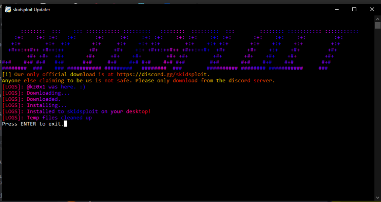

# Bootystrapper

Welcome to the **Bootystrapper**! This project serves as an open-sourced template for creating an updater for your executors. It features a simple command-line interface that allows users to download and extract files easily.

## Features

- **ASCII Art Logo**: Customizable logo using ASCII art.
- **Auto-Download**: Automatically downloads a zip file from a specified URL.
- **Installation**: Extracts the downloaded files to a specified folder on the user's Desktop.
- **Dependency Management**: Automatically installs required Python packages if they are not already installed.
- **Beautiful Console**: Just pleasing to eyes.
---



## Requirements

Before you begin, ensure you have met the following requirements:

- Python 3.x installed on your system (recommended Python 3.12).
- `pip` for installing packages.
- A Windows Operating System

## Getting Started

1. **Clone the Repository**:
   Clone this repository to your local machine using the following command:
   ```bash
   git clone https://github.com/cashsoftworks/Bootystrapper
   cd skidsploit-updater
   ```

2. **Install Required Packages**:
   The script will check for necessary packages and install them automatically when run. However, you can manually install them by running:
   ```bash
   pip install requests pystyle --quiet
   ```

3. **Configure the Script**:
   Open the `updater.py` script in your favorite text editor and modify the following configurations:

   - **`zip_file_for_the_download`**: Update this with the URL of the zip file you want to download.
   - **`folder_name_for_ext`**: Change this to the desired folder name where files will be extracted.
   - **`discord`**: Update the Discord invite link for your community.
   - **`executor_name`**: Set the name of your executor.

4. **Run the Updater**:
   After configuring the script, run it using the command:
   ```bash
   python updater.py
   ```

5. **Follow the Prompts**:
   The updater will display the logo and instructions. Follow the on-screen prompts to complete the download and installation process.

## Contribution

Contributions are welcome! If you have suggestions or improvements, please open an issue or submit a pull request.

## License

This project is licensed under the MIT License - see the [LICENSE](LICENSE) file for details.

## Acknowledgments

- Thanks to [patorjk.com](https://patorjk.com/software/taag/) for the ASCII art generator.
- Special thanks to the community for their support and contributions.
